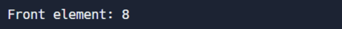
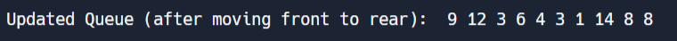

# CS303Assignment3

This program implements the Queue data structure using linked lists with a template class.

## Part 1
### Node Data Strcuture
- data: to keep track of the data in the node
- next: pointer to the next node
- constructor defintion: create a Node structure

### Queue Class
#### Private Data Members
- head: A pointer to the first node of the list.
- tail: A pointer to the last node of the list.
- currentSize: Tracks the number of the size of the list

#### Function Members
- Constructor
- Destructor
- bool empty() const - Checks if the Queue is empty or not
- void push(T value) - Pushes a new value to the end of the queue
- void pop() - Remove the first element from the queue
- front() - Return the first element of the queue
- int size() const - Return the size of the Queue
- void move_to_rear() - Move the first element to the end of the Queue

#### Sample Implementation
1. Create a queue of integers

'''

     Queue<int> myQueue;

'''

2. Using the push function, insert 10 integer values into the Queue

'''

     myQueue.push(8);
     myQueue.push(9);
     myQueue.push(12);
     myQueue.push(3);
     myQueue.push(6);
     myQueue.push(4);
     myQueue.push(3);
     myQueue.push(1);
     myQueue.push(14);
     myQueue.push(8);

'''

Updated Queue:

'''
    

'''

3. Using the front function to print the element of the Queue

'''

     cout << "\nFront element: " << myQueue.front() << endl;

'''

Output:

'''
    

'''

4. Using the size function to print the size of the Queue

'''

     cout << "\nQueue size: " << myQueue.size() << endl;

'''

Output:

'''
    

'''

5. Using the empty function to check if the queue is empty

'''

     if (myQueue.empty())
          cout << "\nThe queue is empty." << endl;
     else
          cout << "\nThe queue is NOT empty." << endl;

'''

Output:

'''
    

'''

6. Using the move_to_rear function to move the first element to the end

'''

     myQueue.move_to_rear();

'''

Output:

'''
    

'''

7. Using the pop function to remove the first element of the queue

'''

     myQueue.pop();

'''

Output:

'''
    

'''

## Part 2

Using a recursive linear search function, find the last occurrence of a target in the Linked List.

### Function Members
#### Private Function
int last_occurrence(Node<T>* node, T target, int index, int& lastIndex) - implements the recursive linear search to find the last occurence

#### Public Function 
int last_occurrence(T target) - public function that returns the last occurence and only takes the target as a parameter

### Implementation

'''

     cout << "\nThe last occurence of element 3 is at index: " << myQueue.last_occurrence(3) << endl;

'''

Output:

'''
    

'''

## Part 3
Implementation of the Insertion Sort Algorithm on Linked Lists

'''

          myQueue.insertion_sort();

'''

Output:

'''
    

'''
